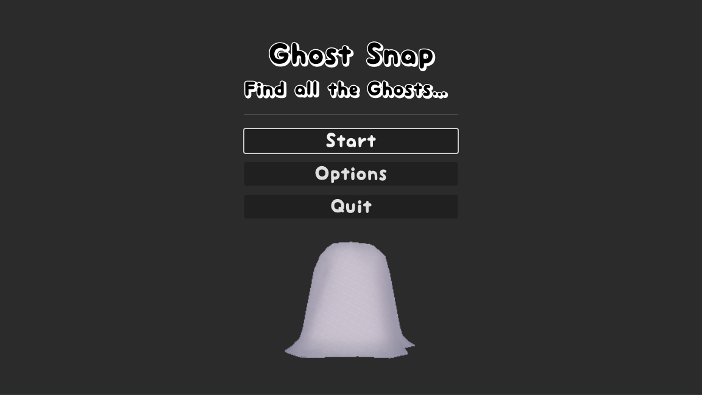
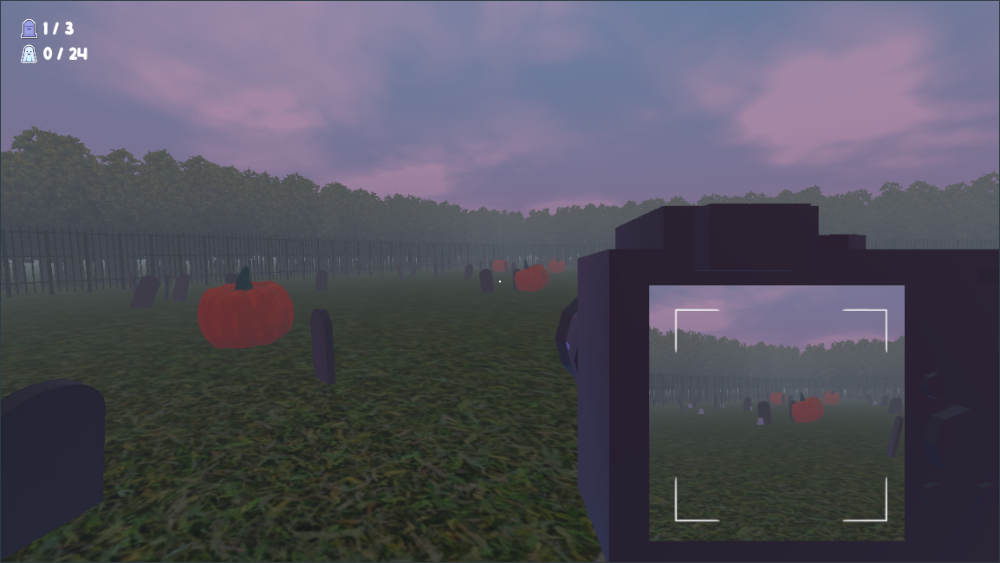
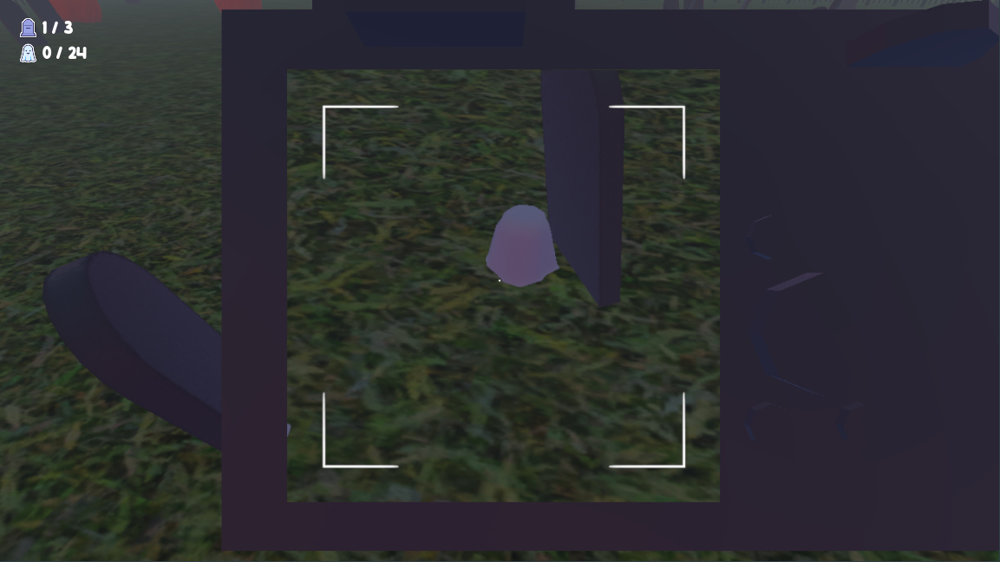

# 👻 Ghost Snap

   

A snap minigame, made with [Godot Engine](https://godotengine.org/), for the [A Game By Its Cover](https://itch.io/jam/a-game-by-its-cover-2023) Game Jam 2023.

## About

Ghost Snap is an open source mini-game about snapping ghosts.

 > Inspired by the Famicase [Ghost Hunter](https://famicase.com/23/softs/103.html) by [Gabby DaRienzo](https://gabbydarienzo.com/).

### Controls

- `WASD` to move.
- `Mouse` to move the camera around.
- `ESC` to quit.

### Screenshots

  

## Contributing

We welcome community contributions to this project.

Please read our [Contributor Guide](CONTRIBUTING.md) for more information on how to get started.
